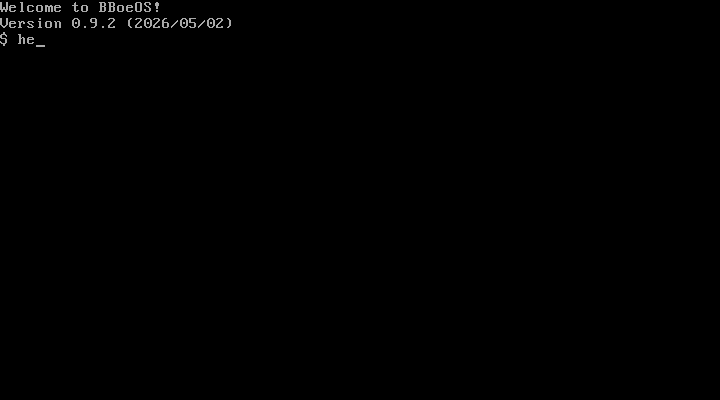

# BBoeOS

<p>
  <a href="https://github.com/bboe/BBoeOS/actions/workflows/test.yml"></a>
  <a href="LICENSE"></a>
  <a href="https://cla-assistant.io/bboe/BBoeOS"></a>
</p>



A minimal x86 operating system: a real-mode bootloader hands off to a paged
32-bit protected-mode kernel that runs userland programs at ring 3.  Includes a
shell, VFS with bbfs and ext2 backends, NE2000 networking (ARP / IP / ICMP /
UDP), a self-hosted assembler, and a custom C subset compiler that translates
`user/programs/*.c` to NASM-compatible assembly on the host.

It also runs Doom:

https://github.com/user-attachments/assets/5efa60a4-c948-4552-9903-23a4c69a0282

The Doom port lives in `ports/doom/` and links against a hand-rolled
freestanding libc (`user/libc/libbboeos.a`).  Build pipeline:
[`ports/doom/build.py`](ports/doom/build.py); shareware-WAD provisioning:
[`ports/doom/fetch_wad.sh`](ports/doom/fetch_wad.sh); one-shot "build + install on a fresh
disk image": [`ports/doom/install.sh`](ports/doom/install.sh).

The kernel ships as two flat binaries (`boot.bin` + `kernel.bin`) concatenated
on disk.  `boot.bin` is the MBR + post-MBR real-mode bootstrap + 32-bit paging
bring-up; `kernel.bin` is the high-half kernel (`org 0xC0020000`) that owns
drivers, filesystems, the network stack, and the INT 30h syscall surface.  Each
user program runs in its own page directory built by `address_space_create`; the
kernel half (PDEs 768..1023) is copy-imaged from a single `kernel_idle_pd`, and
the user half holds the program's text, BSS, stack, and a shared vDSO page.

## Dependencies

* `e2fsprogs` — only when building with `--ext2`
* `nasm` — assembler
* `python3` (3.13+) — runs `add_file.py`, `cc.py`, and the `tests/` harness
  (stdlib only)
* `qemu-system-i386` — to boot the OS

macOS: `brew install e2fsprogs nasm qemu`.  Ubuntu: `sudo apt-get install -y
e2fsprogs nasm qemu-system-x86`.  See
[`docs/requirements.md`](docs/requirements.md) for the full list, including the
macOS keg-only `PATH` gotcha for `e2fsprogs`.

## Minimum runtime requirements

* **1 MB RAM** boots the shell and runs every program in `bin/`, including the
  self-hosted assembler (`asm`), the BSS-stress test (`bigbss`, 256 KB BSS), and
  the 448 KB-BSS editor (`edit`).  The kernel-side fixed-physical region —
  `kernel.bin` (~29 KB) + 4 KB kernel stack + first kernel PT + 8 KB frame
  bitmap — sits in conventional RAM below the VGA aperture at `0xA0000`.
  Filesystem and NIC scratch frames are allocated dynamically from the bitmap
  allocator only when their subsystems initialize, so a no-NIC boot never spends
  those frames.  Default for the `tests/` harness is `qemu-system-i386 -m 1`.
* `qemu-system-i386` defaults to 128 MB, well above the 1 MB floor. Pass `-m 1`
  to exercise the minimum-RAM contract.

## Building and running BBoeOS

* Build the binary

    ./make_os.sh

* Run with QEMU:

    qemu-system-i386 -drive file=drive.img,format=raw

* Run with serial console:

    qemu-system-i386 -drive file=drive.img,format=raw -serial stdio

* Add a file to the filesystem:

    ./add_file.py <file>

* Run the self-hosting assembler test suite (diffs each program in `user/static/`
  against NASM output after reassembling it inside the OS):

    tests/test_asm.py            # full suite
    tests/test_asm.py edit       # one program; artifacts kept in a temp dir

## File Structure

```
kernel/arch/x86/         Architecture-specific code
  boot/boot.asm       Pre-paging boot binary: MBR + post-MBR + early-PE bootstrap
  boot/vga_font.asm   Boot-time BIOS ROM font copy into char-gen slot 0x4000
  kernel.asm          Post-paging high-half kernel (org 0xC0020000)
  entry.asm           protected_mode_entry, IRQ 0 / IRQ 6 handlers, shell respawn
  idt.asm             32-bit IDT, exception stubs, INT 30h gate
  syscall.asm         INT 30h dispatch table
  system.asm          reboot (8042), shutdown (APM / QEMU / Bochs)
kernel/drivers/          ATA, FDC, NE2000, PS/2, RTC, VGA, console, serial
kernel/fs/               block I/O dispatch, VFS, bbfs, ext2, fd table
kernel/include/          Shared constants and helper includes
user/vdso/            shared_print_*, shared_die / shared_exit, vDSO blob
kernel/memory_management/  Bitmap frame allocator (frame.asm)
kernel/net/              ARP, IP, ICMP, UDP
kernel/syscall/          Per-subsystem INT 30h handlers (fs, io, net, rtc, sys)
user/programs/                User-space programs (C sources, compiled by cc.py)
tests/programs/       Test-only programs that exercise specific cc.py / kernel paths
add_file.py           Host-side script to add files to drive image
cc.py                 Host-side C subset compiler
make_os.sh            Build script
```

## Changelog

See [`docs/CHANGELOG.md`](docs/CHANGELOG.md) for a detailed history of changes
by version and date.

## License

BBoeOS is © 2026 Bryce Boe and is licensed under the GNU Affero General Public
License v3.0 — see [`LICENSE`](LICENSE) for the full text and
[`COPYRIGHT`](COPYRIGHT) for the copyright notice.  This is a personal hobby
project and external contributions are accepted only occasionally; when
accepted, they require copyright assignment to the maintainer under the terms of
the [Copyright Assignment Agreement](COPYRIGHT_ASSIGNMENT.md).  See
[`CONTRIBUTING.md`](CONTRIBUTING.md) for the contributor workflow and
[`SECURITY.md`](SECURITY.md) for the private vulnerability reporting process.

## Resources

* https://neosmart.net/wiki/mbr-boot-process/
* https://en.wikibooks.org/wiki/X86_Assembly/Bootloaders
* http://www.ousob.com/ng/asm/ng1f806.php
* https://en.wikipedia.org/wiki/BIOS_interrupt_call
* ftp://ftp.embeddedarm.com/old/saved-downloads-manuals/EBIOS-UM.PDF
